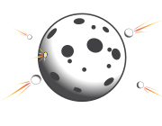

.. _contributing:

***************************
Contributing to Cratermaker
***************************

There are many ways to contribute to Cratermaker. You can contribute by reporting bugs, suggesting new features, improving the documentation, or contributing code. We welcome contributions of all kinds, and we will do our best to review and merge your contributions in a timely manner. To submit an issue or pull request, please visit our  `Code Repository <https://github.com/MintonGroup/cratermaker>`__. 

You can browse our `Issues <https://github.com/MintonGroup/cratermaker/issues>`__ page for a list of open issues and feature requests. If you find a bug or have a suggestion for a new feature, please submit an issue. If you would like to contribute code, please submit a pull request with your changes. We will review your pull request and provide feedback as needed.

Install from source
===================

For developers, you wwill likely want to install Cratermaker from source. This will allow you to make changes to the code and test them out without having to wait for a new release. You can find instructions on how to install Cratermaker from source in the :ref:`Installation from source <ug-installation-from-source>` section of the documentation.

.. note:: 
    
    Stay tuned for more detailed information coming soon!

