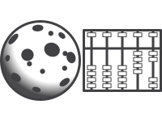

.. currentmodule:: cratermaker

.. ipython:: python
    :okwarning:
    :suppress:

    from cratermaker import cleanup
    cleanup()

.. _ug-counting:

Counting
========

The :py:class:`~cratermaker.components.counting.Counting`  class will be used to tally craters on the surface. It is currently under development, so not all of the core features are fully implemented. Currently we have implemented a simple rim-finding algorithm that can be used to measure crater diameters and locations. 

Tracking emplaced and observed craters
--------------------------------------

One of the core responsibilities of the :py:class:`~cratermaker.components.counting.Counting` class is to to keep track of the craters that have been emplaced onto the surface and to tally up the total population of craters that are observable on the surface at the present time. These are stored as two attributes, :py:attr:`~cratermaker.components.counting.Counting.emplaced` and :py:attr:`~cratermaker.components.counting.Counting.observed`, and are primarily meant to be used as part of a :ref:`Simulation <ug-simulation>` instance. The :py:attr:`~cratermaker.components.counting.Counting.emplaced` list contains all of the craters that have been emplaced onto the surface *in the current run interval*, while :py:attr:`~cratermaker.components.counting.Counting.observed` is a dictionary containing all observable craters on the surface as values and keyed by each crater's unique id. During a simulation run, craters are periodically tallied, and if they are determined to be too degraded to observe, are removed from the :py:attr:`~cratermaker.components.counting.Counting.observed` dictionary. 

The criteria for whether a crater is observable or not depends on the specific version of :py:class:`~cratermaker.components.counting.Counting` that is being used, however currently there is only one available ("simplecount"). The counting method uses the concepts of the "degradation state" and "visibility function" defined in Minton et al. (2019) [#]_. The degradation state is a measure of diffusive topographic diffusion, but the current model it uses the depth-to-diameter ratio  as a proxy by way of eq. 9 of Minton et al., with a correction factor for complex craters from Riedel et al. (2020) [#]_. 

Refining a crater's size and location with fit_rim
--------------------------------------------------

:py:meth:`~cratermaker.components.counting.Counting.fit_rim` refines the *measured* rim geometry of a :py:class:`~cratermaker.components.crater.Crater` by searching for a high-scoring set of rim points on the current surface and fitting either a circle or an ellipse to those points. It returns a **new** :py:class:`~cratermaker.components.crater.Crater` with updated :py:attr:`~cratermaker.components.crater.CraterVariable.measured_location`, :py:attr:`~cratermaker.components.crater.CraterVariable.measured_semimajor_axis`, :py:attr:`~cratermaker.components.crater.CraterVariable.measured_semiminor_axis`, and :py:attr:`~cratermaker.components.crater.CraterVariable.measured_orientation`.

Basic usage
^^^^^^^^^^^

.. code-block:: python

   crater_fit = counting.fit_rim(
       crater,
       tol=0.01,
       nloops=10,
       score_quantile=0.95,
       fit_center=False,
       fit_ellipse=False,
   )

Fit types
^^^^^^^^^

:py:meth:`~cratermaker.components.counting.Counting.fit_rim` supports four common modes, controlled by ``fit_ellipse`` and ``fit_center`` arguments:

Circle vs. ellipse
""""""""""""""""""

- ``fit_ellipse=False`` (default): **circle fit**
  - Returns ``measured_semiminor_axis == measured_semimajor_axis``
  - Returns ``measured_orientation == 0`` (orientation is not meaningful for a circle)

- ``fit_ellipse=True``: **ellipse fit**
  - Returns semi-major axis ``a``, semi-minor axis ``b``, and an orientation angle.

Fixed vs. floating center
"""""""""""""""""""""""""

- ``fit_center=False`` (default): **fixed-center fit**
  - The crater center is held fixed at the current ``crater.measured_location``.
  - Only the size (circle radius or ellipse axes) and (for ellipses) orientation are fit.

- ``fit_center=True``: **floating-center fit**
  - The algorithm also adjusts the crater center (``measured_location``) while fitting.

How the algorithm runs
^^^^^^^^^^^^^^^^^^^^^^

Each iteration:

1. A local region is extracted around the current best-fit crater location using
   an extent proportional to the crater radius.
2. Face projection coordinates are prepared so the region can be treated in a local 2D frame.
3. A per-face **rim score** is computed (see below), and only the highest-scoring points are kept.
4. A weighted fit is performed (circle or ellipse; fixed or floating center).
5. The fitted parameters are compared to the previous iteration. If both axis changes
   fall below ``tol`` (relative to the crater radius), iteration stops early.
   Otherwise, the crater parameters are updated and the loop continues, up to ``nloops``.

The returned crater uses the final fitted parameters. The implementation also attaches a ``rimscore`` field
to the extracted region for debugging/visualization.

Rim scoring
"""""""""""

Rim scoring combines three cues computed on the surface mesh:

1. **Distance-to-rim consistency**
   - For each face, compute the signed radial distance to the current candidate rim.
   - Convert that distance into a score that is highest near the rim and decreases away from it.
   - Faces far outside the expected rim zone are masked out.

2. **Height cue**
   - Face elevations are normalized, then *weighted by the distance score* so that elevation structure near the rim matters more than far-field terrain.

3. **Gradient and curvature cues (radial)**
   - A radial gradient of face elevation is computed, and then a second radial gradient (interpreted as radial curvature) is computed from that.
   - The gradient cue is designed to favor faces near a radial-gradient extremum.
   - The curvature cue favors ridge-like structure (negative radial curvature) and suppresses valleys.

These three normalized cues are combined into a single rim score:

.. math::

   \mathrm{rimscore} = w_g \, G + w_c \, C + w_h \, H

where ``G``, ``C``, and ``H`` are the gradient-, curvature-, and height-based scores, and the multipliers
``(w_g, w_c, w_h)`` vary by iteration in the current implementation:
the gradient and curvature weights decrease over iterations, while the height weight increases,
so early iterations are guided more by shape/derivatives and later iterations emphasize topography.

Sector balancing and ``score_quantile``
^^^^^^^^^^^^^^^^^^^^^^^^^^^^^^^^^^^^^^^

To avoid the fit being dominated by a single arc of the rim, scores are normalized *by bearing sector*:

- Bearings are binned into 36 sectors around the crater.
- Scores are normalized by the maximum score within each sector.
- Then, within each sector, only points above the per-sector quantile threshold
  ``score_quantile`` are retained (e.g., 0.95 keeps the top 5% of scores per sector).

If too few points survive this thresholding (relative to a minimum per-sector requirement),
the algorithm automatically relaxes the selection to ensure enough points are available to fit.

Parameters
^^^^^^^^^^

``tol`` : float
    Convergence threshold for changes in fitted axes (relative to crater radius).

``nloops`` : int
    Maximum number of refinement iterations.

``score_quantile`` : float
    Per-sector quantile threshold for selecting high-scoring rim points.
    Higher values are stricter (fewer points, more conservative); lower values include more points.

``fit_center`` : bool
    If True, fit the crater center as well (floating-center). If False, hold it fixed.

``fit_ellipse`` : bool
    If True, fit an ellipse. If False, fit a circle.

Notes and tips
^^^^^^^^^^^^^^

- Start with the defaults (circle, fixed center). Enable ellipse fitting only if you
  expect strong ellipticity.
- If the crater's initial location is uncertain, enable ``fit_center=True`` so the fit can re-center.
- If fits are unstable, reduce ``score_quantile`` (use more points) or increase ``nloops`` (more refinement),
  and ensure the initial crater size/location are reasonable for the extracted region.

More Counting examples
----------------------

See more examples at  :ref:`gal-counting`

References
----------

 .. [#] Minton, D.A., Fassett, C.I., Hirabayashi, M., Howl, B.A., Richardson, J.E., (2019). The equilibrium size-frequency distribution of small craters reveals the effects of distal ejecta on lunar landscape morphology. Icarus 326, 63-87. https://doi.org/10.1016/j.icarus.2019.02.021
 .. [#] Riedel, C., Minton, D.A., Michael, G., Orgel, C., Bogert, C.H. van der, Hiesinger, H., 2020. Degradation of Small Simple and Large Complex Lunar Craters: Not a Simple Scale Dependence. Journal of Geophysical Research: Planets 125, e2019JE006273. https://doi.org/10.1029/2019JE006273

.. ipython:: python
    :okwarning:
    :suppress:

    cleanup()
