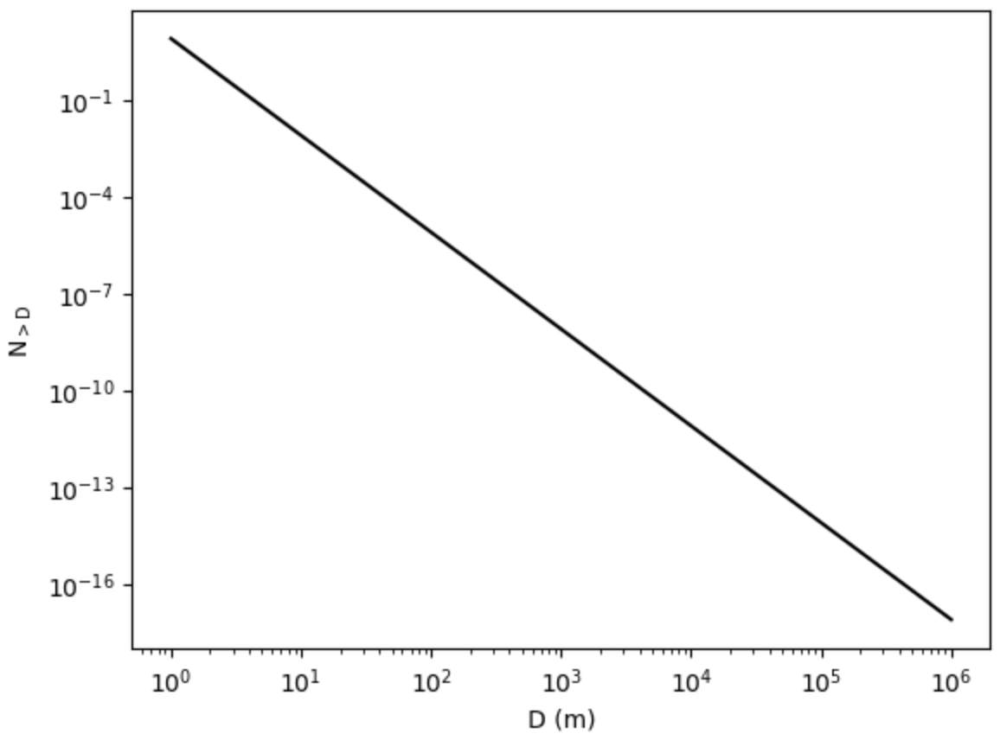
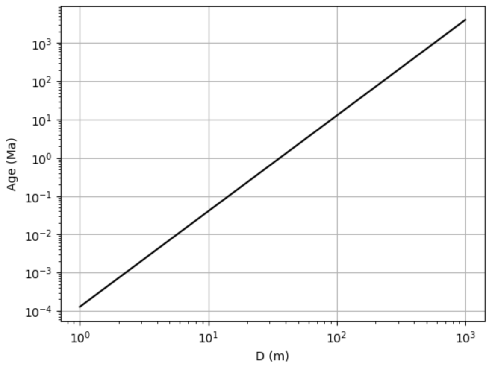
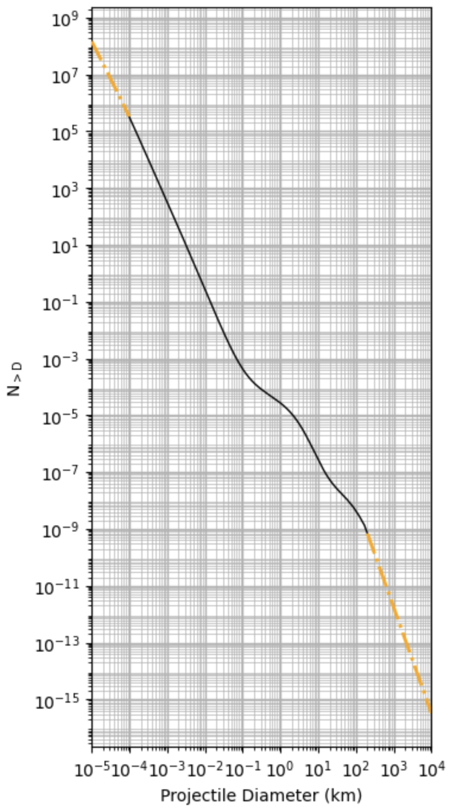
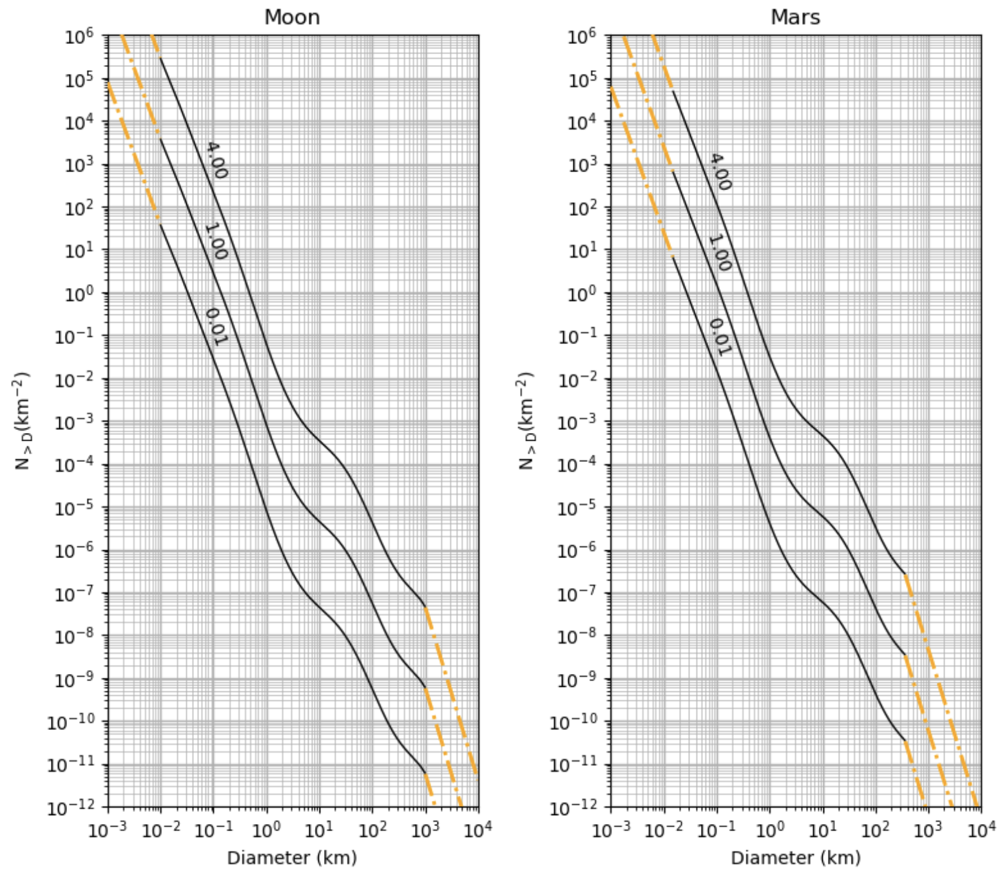
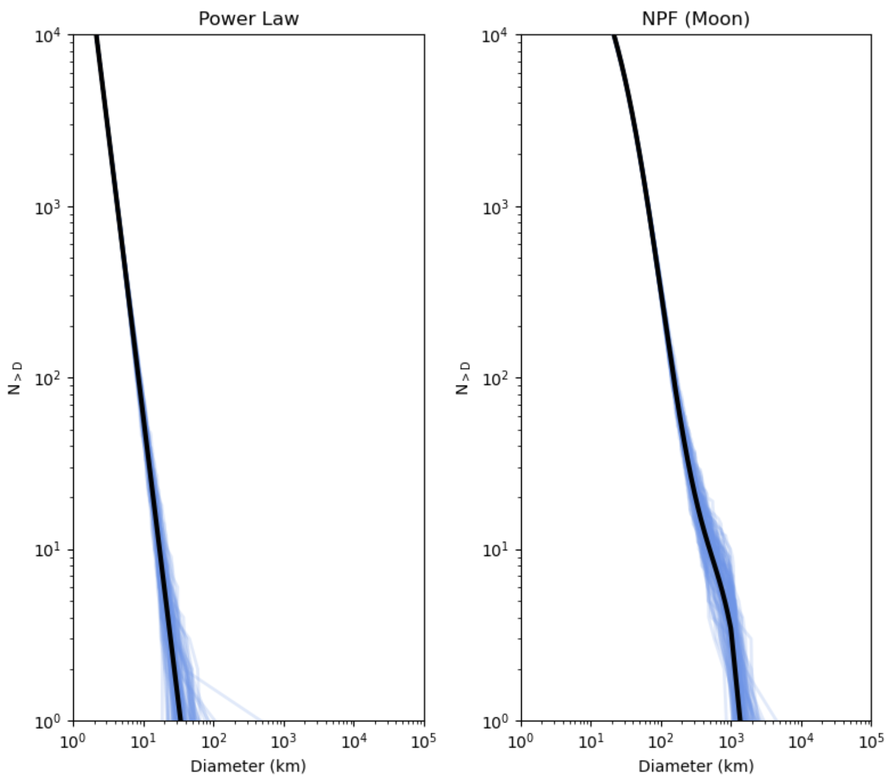
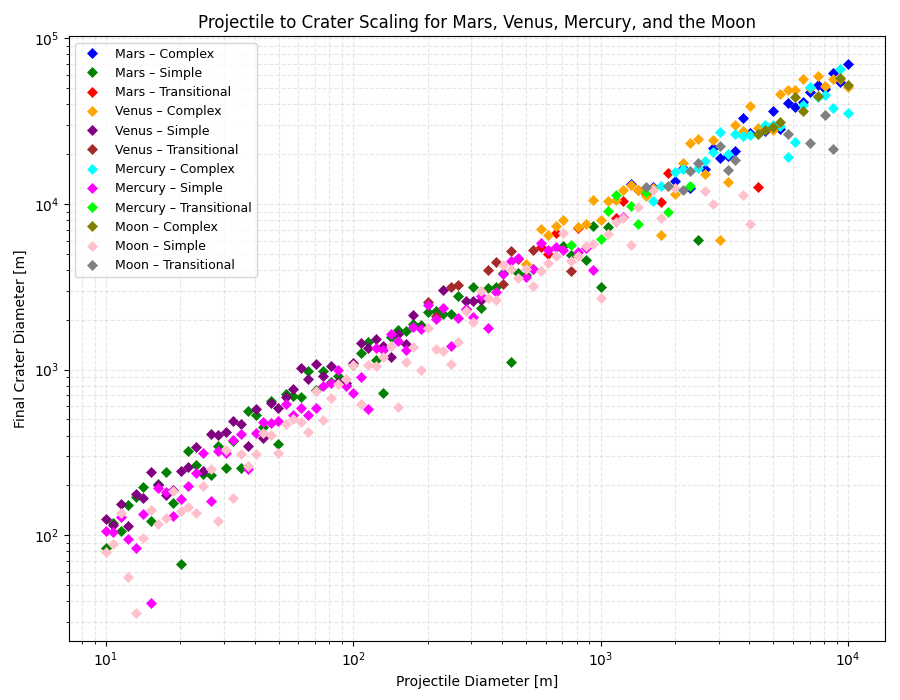

###########
User Guide
###########

Like Cratermaker itself, this user guide is under development. More information will be added over time and as Cratermaker evolves.

###########################
Using the Production Module
###########################

Cratermaker's production module provides a robust way to compute the production function for craters and impactors. The production function is defined as the cumulative number of craters greater than a given diameter per unit m\ :sup:`2` surface area. 

The Production class
====================

The :ref:`api-Production` class implements a simple power law production function that can be used as either a crater or projectile production function. It has the following parameters:

- **generator_type**: Can be either ``"crater"`` (default) or ``"projectile"``.
- **N1_coef**: The coefficient for the power law at 1m diameter per 1 My. Default depends on generator type: It is ``7.9e-3`` for craters or ``2.2e-8`` for impactors. These are both based on fits to the lunar production function.
- **slope**: This is the slope of the power law. Like N1, it differs based on craters or impactors and is based on fits to the lunar production function. Default for craters is ``-3.33`` and for impactors is ``-2.26``.
- **impact_velocity_model**: The mean impact velocity model to use in the impact simulation. Valid option are ``"Mercury_MBA"``", ``"Venus_MBA"``, ``"Earth_MBA"``, ``"Moon_MBA"``, ``"Mars_MBA"``, and ``"MBA_MBA"``.
- **mean_velocity**: Instead of using a mean impact velocity model for an Inner Solar System planet or Main Asteroid Belt, you can use this parameter to manually define a mean impact velocity. Either ``mean_velocity`` or ``impact_velocity_model`` must be provided.

:func:`cratermaker.Production.function` returns the CSFD of craters over a given age range and crater diameter for a simple power law model. It has the following parameters:

- **diameter**: Crater diameter(s) in units of meters to compute corresponding cumulative number density value.
- **age**: Age in units of My relative to the present, used to compute the CSFD. Default is ``1.0``, corresponding to 1 Ma.
- **age_end**: ending age in units of My relative to the present, also used to compute the CSFD. Default is ``0.0``, which corresponds to the present day.

Example: Using Production.function
==================================

For this example, we are going to use :func:`cratermaker.Production.function` to find the cumulative number of craters greater than 1 km per square meter expected to form on a surface in 3 Ga using a power law with a slope of -2. We will use ``"Moon_MBA"`` for the impactor velocity model.

.. code-block:: python

   import cratermaker
   production = cratermaker.Production(slope=-2.0,impact_velocity_model='Moon_MBA')
   cn = production.function(diameter=1000.0,age=3000.0,age_end=0.0)
   print(cn)

Example: Plot a production function with a slope of -3 for craters 1m to 100km over 1 Ga
========================================================================================

.. code-block:: python

   import cratermaker
   import matplotlib.pyplot as plt
   import numpy as np

   production = cratermaker.Production(slope=-3.0,impact_velocity_model='Moon_MBA')
   pf = production.function(diameter=np.arange(1,1e6),age=1000.0,age_end=0.0)
   f1 = plt.figure(1)
   a1 = f1.add_subplot(111)
   a1.loglog(np.arange(1,1e6),pf,color='k')
   a1.set_xlabel('D (m)')
   a1.set_ylabel('$\\mathregular{N_{>D}}$')

:func:`cratermaker.Production.function_inverse` returns the age in My for a given crater number density and diameter. It has the following parameters:

- **diameter**: Diameter of the crater in m
- **cumulative_number_density**: Number density of craters per m\ :sup:`2` surface area greater than the input diameter.

Example: Using Production.function_inverse
==========================================

For this example, we are going to use :func:`cratermaker.Production.function_inverse` to plot the age in Ma for a number density of 1e-6 for craters from 1 m to 1 km in diameter. 

.. code-block:: python

   import cratermaker
   import matplotlib.pyplot as plt
   import numpy as np

   production = cratermaker.Production(slope=-2.5,impact_velocity_model='Moon_MBA')
   inv = tp.function_inverse(diameter=np.arange(1,1000),cumulative_number_density=1e-6*np.ones(len(np.arange(1,1000))))

   f1 = plt.figure(1)
   a1 = f1.add_subplot(111)
   a1.loglog(np.arange(1,1000),inv,color='k')
   a1.set_xlabel('D (m)')
   a1.set_ylabel('Age (Ma)')
   plt.grid()

Using the NeukumProduction class
================================

The :ref:`api-NeukumProduction` class can compute the Neukum production function for the Moon and Mars. The Neukum production function is  is computed using the model of Ivanov, Neukum, and Hartmann (2001) SSR v. 96 pp. 55-86 for the Moon and Mars, with minor changes.

The main parameter is **model**, which is the specific model to use for the production function. Defaults to ``Moon``, but could also be ``Mars`` or ``Projectile``. The choice of ``model`` sets a number of parameters for the Neukum production. See :class:`cratermaker.NeukumProduction` for more, including references.

Example: Plot the Neukum projectile CSFD
========================================

.. code-block:: python

   import cratermaker
   import matplotlib.pyplot as plt
   import numpy as np
   import matplotlib.ticker as ticker

   fig = plt.figure(1, figsize=(4, 7))
   ax = fig.add_subplot(111)

   x_min = 1e-5
   x_max = 1e4
   y_min = 1e-7
   y_max = 1e13
   nD = 1000
   Dvals = np.logspace(np.log10(x_min), np.log10(x_max), num=nD)
   production = cratermaker.NeukumProduction(model="Projectile",impact_velocity_model = "Moon_MBA")
   ax.set_xscale('log')
   ax.set_yscale('log')
   ax.set_ylabel('$\\mathregular{N_{>D}}$')
   ax.set_xlabel('Projectile Diameter (km)')
   ax.set_xlim(x_min, x_max)
   #ax.set_ylim(y_min, y_max)
   ax.yaxis.set_major_locator(ticker.LogLocator(base=10.0, numticks=20))
   ax.yaxis.set_minor_locator(ticker.LogLocator(base=10.0, subs=np.arange(2,10), numticks=100))
   ax.xaxis.set_major_locator(ticker.LogLocator(base=10.0, numticks=20))
   ax.xaxis.set_minor_locator(ticker.LogLocator(base=10.0, subs=np.arange(2,10), numticks=100))
   ax.grid(True,which="minor",ls="-",lw=0.5,zorder=5)
   ax.grid(True,which="major",ls="-",lw=1,zorder=10)
   inrange = (Dvals >= production.sfd_range[0]) & (Dvals <= production.sfd_range[1])
   lo = Dvals < production.sfd_range[0]
   hi = Dvals > production.sfd_range[1]
   t = 1.0
   Nvals = production.function(diameter=Dvals*1e3,age=t*1e3)
   Nvals *= 1e6 # convert from m^-2 to km^-2
   ax.plot(Dvals[inrange], Nvals[inrange], '-', color='black', linewidth=1.0, zorder=50)
   ax.plot(Dvals[lo], Nvals[lo], '-.', color='orange', linewidth=2.0, zorder=50)
   ax.plot(Dvals[hi], Nvals[hi], '-.', color='orange', linewidth=2.0, zorder=50)

   plt.tick_params(axis='y', which='minor')
   plt.tight_layout()
   plt.show()

:func:`cratermaker.NeukumProduction.function` works similar to the power law function described above, and :func:`cratermaker.NeukumProduction.chronology` returns the  relative number of craters produced over a given age range. Note that these functions take the age argument in the Cratermaker unit of My instead of Gy.

Example: Plot the NPF Chronology function for the Moon and Mars
===============================================================

.. code-block:: python

   import cratermaker
   import matplotlib.pyplot as plt

   fig = plt.figure(1, figsize=(8, 4))
   ax = fig.add_subplot(111)
   ax.set_yscale('log')
   ax.set_ylabel('$\\mathregular{N(1) (km^{-2})}$')
   ax.set_xlabel('Time (Gy ago)')
   ax.set_xlim(4.5, 0)
   moon = cratermaker.NeukumProduction(model="Moon")
   mars = cratermaker.NeukumProduction(model="Mars")
   tvals = np.linspace(4.5, 0.0, num=1000)
   N1_moon = moon.function(diameter=1000.0, age=tvals*1e3)*1e6
   N1_mars = mars.function(diameter=1000.0, age=tvals*1e3)*1e6
   ax.plot(tvals, N1_moon, '-', color='dimgrey', linewidth=2.0, zorder=50, label="Moon")
   ax.plot(tvals, N1_mars, '-', color='orange', linewidth=2.0, zorder=50, label="Mars")
   ax.legend()
   plt.tight_layout()
   plt.show()

.. image:: ../_static/chronology.png
   :alt: The Neukum chronology function for the Moon and Mars.
   :scale: 50 %
   :align: center

Example: Plot the NPF CSFD with isochrons at 1 Ma, 1 Ga, and 4 Ga
=================================================================

.. code-block:: python

   import cratermaker
   import matplotlib.pyplot as plt
   import numpy as np

   fig = plt.figure(1, figsize=(8, 7))
   ax = {'Moon': fig.add_subplot(121),
      'Mars': fig.add_subplot(122)}

   tvals = [0.01,1.0,4.0]
   x_min = 1e-3
   x_max = 1e4
   y_min = 1e-12
   y_max = 1e6
   nD = 1000
   Dvals = np.logspace(np.log10(x_min), np.log10(x_max), num=nD)
   for key in ax:
      production = cratermaker.NeukumProduction(model=key)
      ax[key].title.set_text(key)
      ax[key].set_xscale('log')
      ax[key].set_yscale('log')
      ax[key].set_ylabel('$\\mathregular{N_{>D} (km^{-2})}$')
      ax[key].set_xlabel('Diameter (km)')
      ax[key].set_xlim(x_min, x_max)
      ax[key].set_ylim(y_min, y_max)
      ax[key].yaxis.set_major_locator(ticker.LogLocator(base=10.0, numticks=20))
      ax[key].yaxis.set_minor_locator(ticker.LogLocator(base=10.0, subs=np.arange(2,10), numticks=100))
      ax[key].xaxis.set_major_locator(ticker.LogLocator(base=10.0, numticks=20))
      ax[key].xaxis.set_minor_locator(ticker.LogLocator(base=10.0, subs=np.arange(2,10), numticks=100))
      ax[key].grid(True,which="minor",ls="-",lw=0.5,zorder=5)
      ax[key].grid(True,which="major",ls="-",lw=1,zorder=10)
      inrange = (Dvals >= production.sfd_range[0]) & (Dvals <= production.sfd_range[1])
      lo = Dvals < production.sfd_range[0]
      hi = Dvals > production.sfd_range[1]
      for t in tvals:
         Nvals = production.function(diameter=Dvals*1e3,age=t*1e3)
         Nvals *= 1e6 # convert from m^-2 to km^-2
         ax[key].plot(Dvals[inrange], Nvals[inrange], '-', color='black', linewidth=1.0, zorder=50)
         ax[key].plot(Dvals[lo], Nvals[lo], '-.', color='orange', linewidth=2.0, zorder=50)
         ax[key].plot(Dvals[hi], Nvals[hi], '-.', color='orange', linewidth=2.0, zorder=50)
         labeli = int(0.25*nD)
         ax[key].text(Dvals[labeli],3*Nvals[labeli],f"{t:.2f} ", ha="left", va="top",rotation=-72)

   plt.tick_params(axis='y', which='minor')
   plt.tight_layout()
   plt.show()

:func:`cratermaker.Production.sample` allows you to sample crater diameters and ages from the production function (either power law or Neukum). This function can either sample from a given age range or from a given cumulative number/diameter pair, but not both. 

Example: Sample a power law and lunar Neukum Production Function
================================================================

.. code-block:: python

   import cratermaker
   import matplotlib.pyplot as plt
   import numpy as np

   fig = plt.figure(1, figsize=(8, 7))
   ax = {'Power Law': fig.add_subplot(121),
      'NPF (Moon)': fig.add_subplot(122)}

   production = {
               'Power Law': cratermaker.Production(impact_velocity_model = "Moon_MBA"),
               'NPF (Moon)': cratermaker.NeukumProduction(model="Moon")
               }

   target = cratermaker.Target("Moon")
   area = 4*np.pi*target.radius**2 
   age = 4100.0
   x_min = 1e0
   x_max = 1e5
   y_min = 1e0
   y_max = 1e4
   diameter_range = (2e3,10000e3) # Range of diameters to generate in m
   nD = 1000
   Dvals = np.logspace(np.log10(x_min), np.log10(x_max), num=nD)
   Nevaluations = 100
   for key in ax:
      ax[key].title.set_text(key)
      ax[key].set_xscale('log')
      ax[key].set_yscale('log')
      ax[key].set_ylabel('$\\mathregular{N_{>D}}$')
      ax[key].set_xlabel('Diameter (km)')
      ax[key].set_xlim(x_min, x_max)
      ax[key].set_ylim(y_min, y_max)
      ax[key].yaxis.set_major_locator(ticker.LogLocator(base=10.0, numticks=20))
      ax[key].yaxis.set_minor_locator(ticker.LogLocator(base=10.0, subs=np.arange(2,10), numticks=100))
      ax[key].xaxis.set_major_locator(ticker.LogLocator(base=10.0, numticks=20))
      ax[key].xaxis.set_minor_locator(ticker.LogLocator(base=10.0, subs=np.arange(2,10), numticks=100))
      # Plot the sampled values
      for i in range(Nevaluations):
         Dsampled, _ = production[key].sample(age=age, diameter_range=diameter_range, area=area, return_age=False)
         Dsampled = np.sort(Dsampled)[::-1]
         Nsampled = range(1,len(Dsampled)+1) 
         ax[key].plot(Dsampled*1e-3, Nsampled, '-', color='cornflowerblue', linewidth=2.0, zorder=50, alpha=0.2)
         
      # Plot the production function 
      Nvals = production[key].function(diameter=Dvals*1e3,age=age)
      Nvals *= area # convert from per unit area to total number
      ax[key].plot(Dvals, Nvals, '-', color='black', linewidth=3.0, zorder=50)

   plt.tick_params(axis='y', which='minor')
   plt.tight_layout()
   plt.show()   

.. toctree::
   :maxdepth: 2
   :hidden:

##########################
Using the scaling Module
##########################

Cratermaker's ``scaling`` module provides tools to convert impactor parameters (e.g., projectile diameter, velocity, and target properties) into a final crater diameter. It also categorizes craters by their morphology: **simple**, **transitional**, or **complex**.

This example simulates how crater diameters vary with projectile size across different planetary bodies — specifically **Mars**, **Venus**, **Mercury**, and the **Moon** — and visualizes this relationship.

Example: Crater scaling for various planetary surfaces
=======================================================

.. code-block:: python

   import numpy as np
   import matplotlib.pyplot as plt

   from cratermaker import (
       Projectile, Target, scaling
   )

   def plot_projectile_to_crater_scaling():
       bodies = ["Mars", "Venus", "Mercury", "Moon"]
       proj_diameters = np.logspace(1, 4, 100)
       markersize = 5
       markerstyle = 'D'

       fig, ax = plt.subplots(figsize=(9, 7))
       ax.set_xscale("log")
       ax.set_yscale("log")
       ax.set_xlabel("Projectile Diameter [m]")
       ax.set_ylabel("Final Crater Diameter [m]")
       ax.set_title("Projectile to Crater Scaling for Mars, Venus, Mercury, and the Moon")

       colors = [
           "blue", "green", "red", "orange", "purple", "brown",
           "cyan", "magenta", "lime", "olive", "pink", "gray"
       ]

       color_index = 0
       label_color_map = {}

       for body in bodies:
           target = Target(body)
           scaling = scaling(target=target)
           crater_diams = []
           morphs = []

           for d in proj_diameters:
               proj = Projectile(
                   diameter=d,
                   mean_velocity=target.escape_velocity + 1000,
                   target=target
               )
               crater = scaling.projectile_to_crater(proj)
               crater_diams.append(crater.diameter)
               morphs.append(scaling.get_morphology_type(crater.diameter))

           for morph in np.unique(morphs):
               mask = np.array(morphs) == morph
               label = f"{body} – {morph.capitalize()}"

               if label not in label_color_map:
                   color = colors[color_index % len(colors)]
                   label_color_map[label] = color
                   color_index += 1

               ax.plot(
                   proj_diameters[mask],
                   np.array(crater_diams)[mask],
                   markerstyle,
                   markersize=markersize,
                   linestyle='None',
                   label=label,
                   color=label_color_map[label],
                   markeredgewidth=0.5
               )

       handles, labels = ax.get_legend_handles_labels()
       unique = dict(zip(labels, handles))
       ax.legend(unique.values(), unique.keys(), fontsize=9)

       ax.grid(True, which='both', linestyle='--', alpha=0.3)
       plt.tight_layout()
       plt.show()

   if __name__ == "__main__":
       plot_projectile_to_crater_scaling()

Explanation
-----------

- The function creates a range of projectile diameters from 10 to 10,000 meters.
- For each body, a ``Target`` and corresponding ``scaling`` object are created.
- Projectiles are launched at a velocity just above escape velocity.
- The resulting crater diameter and morphology are computed using ``scaling.projectile_to_crater`` and ``scaling.get_morphology_type``.
- Crater types are plotted using basic colors, categorized by body and morphology.

This visualization helps compare how gravity and crustal properties of each planetary body influence the final crater size and morphology classification.

