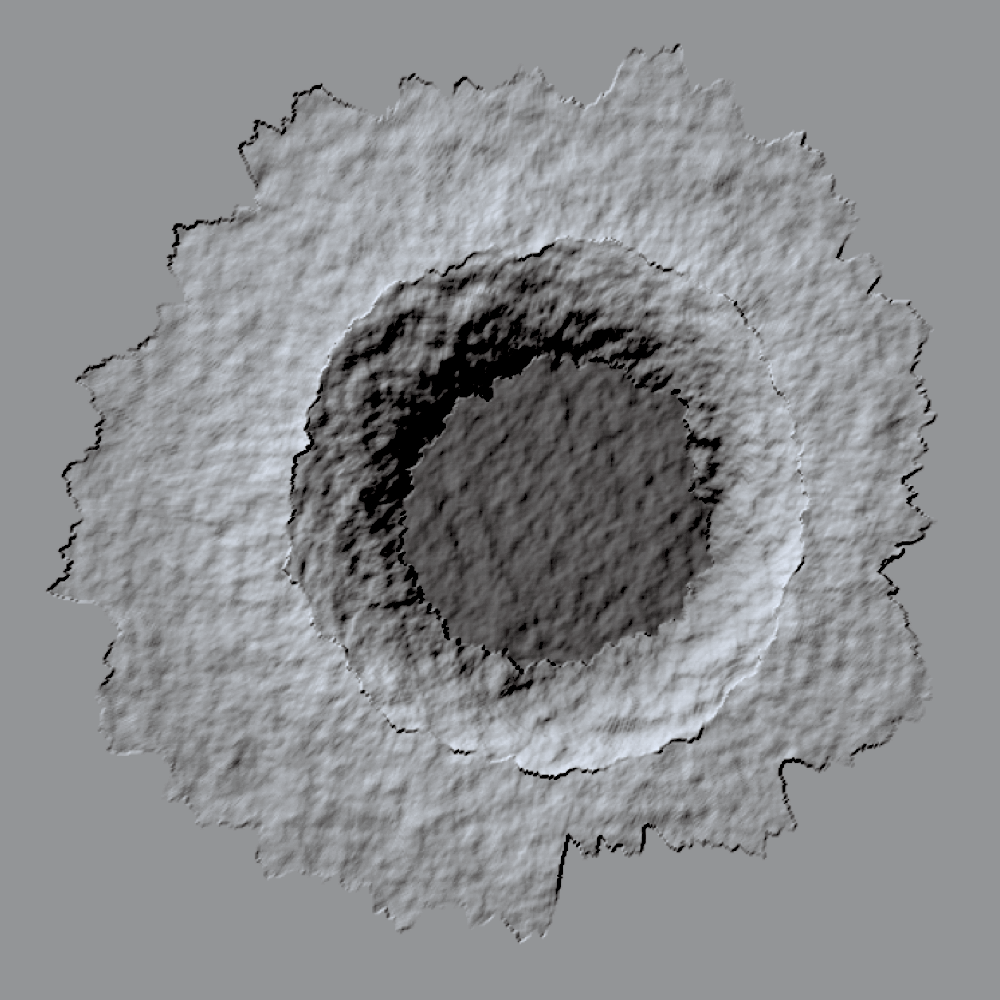

.. currentmodule:: cratermaker

.. _ug-morphology:

Morphology
==========

The Morphology component is used to alter the topography of a :ref:`Surface <ug-surface>` object using a :ref:`Crater <ug-crater>` object. The available morphology models (currently only "simplemoon") determine how crater geometry and ejecta are emplaced. Like other components, a :ref:`Morphology <api-morphology>` model is generated using its :meth:`maker` method:

.. ipython:: python

    from cratermaker import Morphology
    morphology = Morphology.maker("simplemoon")
    print(morphology)

Crater Emplacement
------------------

The main purpose of a Morphology model is to emplace craters on a surface. This can now be done using the queue-aware :meth:`emplace` method, which automatically handles crater preparation, overlap resolution, and surface modification. If you do not provide a surface object, the method will create a default one for you (see :ref:`ug-surface` for more details). 

.. ipython:: python

    from cratermaker import Crater
    crater = Crater.maker(final_diameter=25e3)
    morphology.emplace(crater)

Internally, a morphology model maintains a queue of craters that can be processed in parallel batches, provided they do not affect overlapping regions of the surface mesh. This allows for physically plausible yet efficient crater emplacement across geologic timescales.

Batch Emplacement
-----------------

You can enqueue multiple craters using :meth:`emplace`. Craters are emplaced in chronological order in batches of non-overlapping ejecta.

.. ipython:: python

    craters = [Crater.maker(final_diameter=d) for d in (5e3, 10e3, 15e3)]
    morphology.emplace(craters)

More Morphology Examples
------------------------

See more advanced usage examples in the gallery: :ref:`gal-morphology`

.. toctree::
   :maxdepth: 2
   :hidden:
