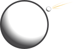

.. currentmodule:: cratermaker

.. _ug-projectile:

Projectile
==========

The ``Projectile`` method contains information about the populations of projectiles used to scale between crater and projectile sizes.

To define a projectile, a :ref:`Target <ug-target>` must be created first. If you're unsure how to define a target, see the :ref:`Target documentation <ug-target>` for guidance.

Creating a Projectile
---------------------

**Example 1: Using a target from the catalogue**

.. ipython:: python

    from cratermaker.components.projectile import Projectile
    from cratermaker.components.target import Target

    # First define the target
    target = Target.maker("Moon")

    #The projectile is determined based on the target by default
    projectile = Projectile.maker(target=target)

    # Print projectile properties
    print(f"cratermaker projectile: {projectile}")

If no projectile parameters are specified, CraterMaker will use a default asteroid population suitable for the specified target.

**Example 2: Creating a custom projectile**

You can specify projectile properties manually using keyword arguments.

.. ipython:: python

    projectile_userdefined = Projectile.maker(
        projectile="generic",
        sample=False,
        velocity=22000.0,   # meters/second
        angle=45.0,         # degrees
        direction=90.0,     
        density=3000.0,     # kg/m³
        target="Moon"
    )
    print("Projectile defined by user:", projectile_userdefined)

In this case, the user specifies the projectile velocity, impact angle, trajectory direction, and material density. The target is still required to complete the projectile's initialization.

More Projectile examples
------------------------

See more examples at  :ref:`gal-projectile`

.. toctree::
   :maxdepth: 2
   :hidden:
