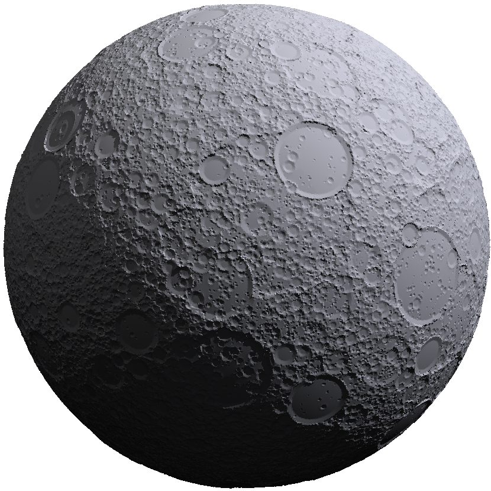

.. currentmodule:: cratermaker

.. _ug-simulation:

##########
Simulation
##########

The Simulation class is the main orchestration tool used to manage and run landscape evolution simulations.

Simulating a population of craters
==================================

Simulating a single crater is useful for testing, but Cratermaker is designed to simulate populations of craters over time. The following example demonstrates how to initialize a simulation of the Moon and emplace a population of craters using the default Neukum production function. The simulation will run for 4.31 Gy, and save the state of the surface in intervals of 50 My.

.. code-block:: python

    import cratermaker as cm
    sim = cm.Simulation()
    sim.run(age=4300, age_interval=50)

.. note::

      The default units for Cratermaker are meters for length and million years for time.
