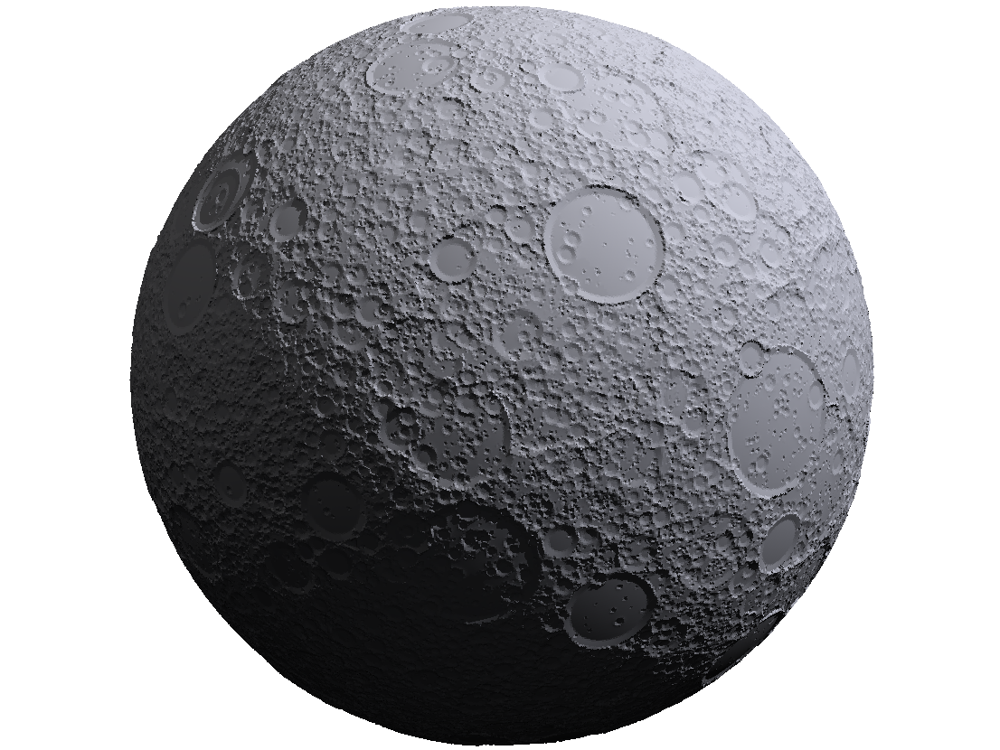

.. py:currentmodule:: cratermaker

.. ipython:: python
    :okwarning:
    :suppress:

    from cratermaker import cleanup
    cleanup()

.. _ug-simulation:

Simulation
==========

The :py:class:`~cratermaker.core.simulation.Simulation` class manages the evolution of cratered planetary surfaces. It contains components such as target bodies, impactor distributions, and emplacement to simulate crater formation over time.

A `Simulation` instance can be initiated with keyword arguments specifying the various component models to be used in the simulation. These components include:

- :ref:`Target <ug-target>`
- :ref:`Scaling <ug-scaling>`
- :ref:`Production <ug-production>`
- :ref:`Morphology <ug-morphology>`
- :ref:`Surface <ug-surface>`
- :ref:`Projectile <ug-projectile>`
- :ref:`Counting <ug-counting>`

Any valid arguments for these components can be passed directly to the :py:class:`~cratermaker.core.simulation.Simulation` constructor, otherwise default values will be used (see the guide for :ref:`Default Behavior <ug-defaults>`).

Creating craters and populations of craters
-------------------------------------------

The :py:class:`~cratermaker.core.simulation.Simulation` class has set of core methods that can be used to generate craters, using the requested (or default) Production and Morphology components onto the requested Surface component. These are :py:meth:`~cratermaker.core.simulation.Simulation.emplace`, :py:meth:`~cratermaker.core.simulation.Simulation.populate`, and :py:meth:`~cratermaker.core.simulation.Simulation.run`. Each successive method makes use of the others (that is, :py:meth:`~cratermaker.core.simulation.Simulation.populate` calls :py:meth:`~cratermaker.core.simulation.Simulation.emplace` on the craters in generates, and :py:meth:`~cratermaker.core.simulation.Simulation.run` calls :py:meth:`~cratermaker.core.simulation.Simulation.populate` for each interval of time in the simulation). We will discuss each of these in turn:

Running a Simulation
--------------------

Once a :py:class:`~cratermaker.core.simulation.Simulation` instance has been created, the simulation can be run using the :py:meth:`~cratermaker.core.simulation.Simulation.run` method. This method requires a ``time_start`` (or, alternatively ``age``) argument specifying the starting time of the simulation in million years before present (My bp). By default, the ``time_end`` will be 0, which indicates that the simulation runs up until the present day. 

The following example configures a simulation targeting the Moon and runs it for 4 Gy, then we plot the number of true emplaced (countable) craters as well as the number of observed craters that the crater counting algorithm has determined are observable. To speed up the example, we have reduced the resolution of the surface grid from the default value of 8 to 6 using the ``gridlevel`` argument.

.. ipython:: python
    :okwarning:
    :suppress:

    cleanup()

.. ipython:: python
    :okwarning:

    from cratermaker import Simulation
    sim = Simulation(target="Moon", gridlevel=6, rng_seed=7636830)
    sim.run(age=4000)
    print(f"Number of true emplaced craters: {sim.n_emplaced}")
    print(f"Number of observed craters: {sim.n_observed}")

.. note::

    You may notice that the number of craters emplaced during the Simulation is much larger than the value of true emplaced craters given by ``sim.n_emplaced``. This is because the :ref:`Counting <ug-counting>` object only tracks craters that are potentially countable. Most of the craters that are emplaced during a simulation are too small to be reliably counted, so while they are still modify the surface, they are not tracked by the counting system.

Multi-interval Simulations
^^^^^^^^^^^^^^^^^^^^^^^^^^

The :py:meth:`~cratermaker.core.simulation.Simulation.run` method can also be used to run a simulation in multiple intervals, which is useful for tracking the evolution of the cratered surface over time. To do this, you can pass either the `time_interval` or `ninterval` arguments. These two arguments are mutually exlusive, as they divide up the simulation in different ways. 

Equal time intervals
""""""""""""""""""""

When passing the `time_interval` argument, the simulation is divided up into equal intervals of time. Depdning on which production function is enabled (see :ref:`Production <ug-production>`) the rate of cratering may be different at different points in time. For instance, in the default Neukum production function for the Moon, the cratering rate is significantly hire prior to about 3 Ga before present, so a simulation that spans these early times will produce more craters in the early time intervals than in the later ones. 

In the example below, we demonstrate how a simulation with `time_interval=1000` would behave by drawing the numbers of craters larger than 10 km between equal time intervals on the surface of the Moon.

.. ipython:: python
    :okwarning:
    :suppress:

    cleanup()

.. ipython:: python
    :okwarning:

    from cratermaker import Simulation

    # We'll pass a rng_seed value so that the example always gives the same answer, and we'll make a low resolution grid because we're just going to be sampling from the production function. 
    sim = Simulation(rng_seed=2029821, gridlevel=5)

    production = sim.production
    target = sim.target
    diameters1, _ = production.sample(time_start=4000, time_end=3000, diameter_range=(10e3, 10000e3), area=target.surface_area, return_age=False)
    print(f"Number of craters emplaced between 4000 Ma and 3000 Ma: {len(diameters1)}")
    diameters2, _ = production.sample(time_start=3000, time_end=2000, diameter_range=(10e3, 10000e3), area=target.surface_area, return_age=False)
    print(f"Number of craters emplaced between 3000 Ma and 2000 Ma: {len(diameters2)}")
    print(f"Ratio of craters emplaced between 4000-3000 Ma to 3000-2000 Ma: {len(diameters1) / len(diameters2)}")

In this example the first billion years (from 4000 Ma to 3000 Ma before present) of a simulation using this production function would produce almost 70 times more craters than the second billion years (from 3000 Ma to 2000 Ma before present).

Equal number of craters per interval
""""""""""""""""""""""""""""""""""""

When passing the `ninterval` argument, the simulation is divided up into intervals that each contain approximately the same number of emplaced craters. The true number of craters produced in each interval won't be exactly the same because the number of craters is goverened by the Poisson distribution. 

In the example below, we will demonstrate how a simulation with equal number intervals would behave by sampling an expected number of 100 craters larger than 10 km: 

.. ipython:: python
    :okwarning:

    diameters1, _ = production.sample(diameter_number=(10e3, 100), diameter_range=(10e3, 10000e3), area=target.surface_area, return_age=False)
    print(f"Number of craters in sample 1: {len(diameters1)}")
    diameters2, _ = production.sample(diameter_number=(10e3, 100), diameter_range=(10e3, 10000e3), area=target.surface_area, return_age=False)
    print(f"Number of craters in sample 2: {len(diameters2)}")

As can be seen, the toltal numbers of craters is somewhat different in each sample, but they are both within the expected variability of the Poisson distribution for a mean of 100 craters in the sample.

Emplace one or more specific craters
^^^^^^^^^^^^^^^^^^^^^^^^^^^^^^^^^^^^

The :py:meth:`~cratermaker.core.simulation.Simulation.emplace` is used to emplace one or more craters onto a surface. The arguments are either the parameters that you would pass to :py:meth:`Crater.maker() <cratermaker.components.crater.Crater.maker>` to generate a single crater, a single :py:class:`~cratermaker.components.crater.Crater` object, or a list of :py:class:`~cratermaker.components.crater.Crater` objects. So for instance, you can emplace a single 300 km crater onto a random location on a surface, you would do:

.. code-block:: python

    from cratermaker import Simulation

    sim = Simulation()
    sim.emplace(diameter=300e3)

To place 3 craters onto the surface, you could do the following:

.. code-block:: python

    craters = [sim.Crater.maker(diameter=d) for d in [100e3, 200e3, 300e3]]
    sim.emplace(craters)

Emplace a population of craters drawn from a production function
^^^^^^^^^^^^^^^^^^^^^^^^^^^^^^^^^^^^^^^^^^^^^^^^^^^^^^^^^^^^^^^^

The :py:meth:`~cratermaker.core.simulation.Simulation.populate` is used to generate a population of craters drawn from whichever :ref:`Production <ug-production>` component module is loaded into the simulation. You can pass either time interval over which to draw from the production function with either "age" or "time_start" and "time_end", or you can provide a pair of numbers in the form of (D,N) that represents the production function in the N(D) convention. For instance, to emplace a population of craters corresponding to the production function between 200 My to 100 My before present, you would do:

.. code-block:: python

    sim.populate(time_start=200, time_end=100)

The :py:meth:`~cratermaker.core.simulation.Simulation.populate` method is really meant to be a helper method for the :py:meth:`~cratermaker.core.simulation.Simulation.run` method, which is used to run a full simulation over a specified time interval. For instance, the :py:meth:`~cratermaker.core.simulation.Simulation.populate` method does not track the time of emplacement or advance the time interval of the simulation.

Quasi-Monte Carlo craters
-------------------------

For some applications, you may want to specify a predefined population of craters that should be emplaced at a certain time and location along with the random population of craters drawn from the production function. To accomplish this, you can initialize a :py:class:`~cratermaker.core.simulation.Simulation` object with an argument `quasimc_file`, which points to either a CSV or NetCDF file containing the information needed to emplace the craters. Alternatively, you  When this argumented is passed, the :py:meth:`~cratermaker.core.simulation.Simulation.run` method will run in "Quasi-Monte Carlo mode". 

Quasi-Monte Carlo mode is a powerful tool that is very flexible. Here we will demonstrate the different ways you can specify craters in the input file and how they affect the behavior of the simulation with a simple donstration using several prominent lunar craters: South Pole-Aitken, Serenitatis, Nectaris, Crisium, Imbrium, Schrödinger, and Orientale. A version of this simulation type with 74 lunar basins is included in the :ref:`gal-simulation`.

First, we we will create a CSV file called "basins_exact_time.csv" and populate it with columns indicating which arguments should be passed to the :py:meth:`Crater.maker() <cratermaker.components.crater.Crater.maker>` function. At a minimum, this requires at least one argument specifying size, such as "diameter" or "projectile_diameter". Usually you would include a location as well, which must be specified with "longitude" and "latitude" as separate columns, rather than the typical "location" tuple that the method call would use. In addition, you typically would provide some indication of when in the simulation you want the crater to form. There are multiple ways to do this.

Emplacing a crater at a specific time or time range
^^^^^^^^^^^^^^^^^^^^^^^^^^^^^^^^^^^^^^^^^^^^^^^^^^^

You can indicate that you want a crater to form at a specific time, as defined by the chronology function of the Simulation's :py:class:`~cratermaker.components.production.Production` component. To do this, you would include the time in a column labeled "production_time". You may also indicate that you want to draw the crater's time from a distribution by supplying an aditional column labeled "production_time_stdev".  Here we will define dates in My before present that each of our lunar craters will form within the Neukum chronology function used for default simulation type. 

We will use the age of the Imbrium impact event reported by Nemchin et al. (2021) of 3922 My, however the true ages for the other craters are very poorly constrained. However, because the chronology function in :py:class:`~cratermaker.components.production.neukum.NeukumProduction` translates model ages into crater number densities, we can pick dates that place our craters in their correct relative sequence within the bombardment history of the early Moon, even if their true age is unknown. We begin our cratering simulation at 4310 My before present, and give that age to the largest and stratigraphically oldest lunar crater, the massive 2400 km diameter South Pole-Aitken basin. 

.. note::

    Always remember that crater chronology model ages are **not** true ages, especially for the period of time prior to 3900 My bp. It's best to think of the model age as a way of expressing crater number density (not the other way around), and is subject to change as better calibration data is obtained. Thus a model age of 4310 My bp just means N(20)=1000 craters per million sq. km. in the Neukum production function, and will likely be updated if and when samples of the South Pole-Aitken melt sheet are returned and dated.

Serenetitatis likely formed before Nectaris, which formed before Crisium and Imbrium, so we set ``production_time`` values for Serenitatis, Nectaris, and Crisium of 4220, 4170, and 4070 My, respectively. Both Schrödinger and Orientale post-date Imbrium, so we set their ``production_time`` values to 3860 and 3810 My, respectively. Therefore our 

.. ipython:: python
    :okwarning:
    :suppress:

    from pathlib import Path
    with Path.open("basins_exact_time.csv", "w") as f:
        f.write("name,latitude,longitude,diameter,production_time\n")
        f.write("South Pole-Aitken,-53,191,2400000,4310\n")
        f.write("Serenitatis,25.4,18.8,923000,4220\n")
        f.write("Nectaris,-15.6,35.1,885000,4170\n")
        f.write("Crisium,16.8,58.4,1076000,4070\n")
        f.write("Imbrium,37,341.5,1321000,3922\n")
        f.write("Schrödinger,-74.9,133.5,326000,3860\n")
        f.write("Orientale,-20.1,265.2,937000,3810\n")

.. ipython:: python
    :okwarning:

    from pathlib import Path

    with Path.open("basins_exact_time.csv", "r") as f:
        print(f.read())

Now we can pass this file into a Simulation, with a reduced resolution to make the example run more quickly. We will also cut off the crater population below 100 km by setting the :py:attr:`~cratermaker.core.simulation.Simulation.smallest_crater` attribute, which will also speed up our simulation as the majority of craters will be small ones. We also pass a value to the rng_seed argument of the Simulation constructor so that the random population of craters drawn from the production function is the same each time this example is run.

.. code-block:: python

    from cratermaker import Simulation
    sim = Simulation(quasimc_file="basins_exact_time.csv",gridlevel=5, ask_overwrite=False, reset=True, rng_seed=298263286)
    sim.smallest_crater = 100e3
    sim.run(age=4310)
    sim.show3d(variable_name="face_elevation")

.. ipython:: python
   :okwarning:
   :suppress:

    from cratermaker import Simulation
    sim = Simulation(quasimc_file="basins_exact_time.csv",gridlevel=5, ask_overwrite=False, reset=True, rng_seed=298263286)
    sim.smallest_crater = 100e3
    sim.run(age=4310)

.. pyvista-plot::
   :caption: Quasi-Monte Carlo simulation with craters emplaced at specific times.
   :include-source: False 

    >>> # The pyvista-plot tool apparently doesn't recognize the show3d method, so we will just show how to do this manually with pyvista.
    >>> import pyvista as pv
    >>> import cratermaker as cm
    >>> sim = cm.Simulation(reset=False)
    >>> plotter = sim.pyvista_plotter(variable_name="face_elevation") 
    >>> plotter.show()

Emplacing a crater at a specific time range
^^^^^^^^^^^^^^^^^^^^^^^^^^^^^^^^^^^^^^^^^^^

In some cases, we may be more confident that a crater forms within a specific time range. To do this, we can set the "production_time_stdev" and "production_time_high" columns in the input file, which will cause the Simulation to draw a random time for that crater in a normal distribution, where the mean is the midpoint between  

.. .. ipython:: python
..     :okwarning:

..     from cratermaker import Simulation
..     sim = Simulation(target="Moon", gridlevel=6, rng_seed=7636830)
..     sim.run(age=4000)
..     print(f"Number of true emplaced craters: {sim.n_emplaced}")
..     print(f"Number of observed craters: {sim.n_observed}")

..                 if not header_written:
..                     header = list(crater_dict.keys())
..                     writer.writerow(header)
..                     header_written = True
..                 row = [crater_dict[key] for key in header]
..                 writer.writerow(row)

Save Actions
------------

The :py:class:`~cratermaker.core.simulation.Simulation` class has a "save_actions" parameter that can be set by any component class and is used to invoke specific method calls on the component when its .save() method is called. This is useful to trigger specific postprocesing actions, like plotting or exporting, at the end of each interval of a Simulation run. The save_actions attribute takes a dictionary where each key is a valid method that can be called on the component (such as "plot", "export", "show3d", etc.) and the values are a dictionary of arguments that you would pass to that method. Currently, Cratermaker has a default save action that will run the plot command, which will get called at the beginning of a run in order to save the initial condiations, and at the end of each interval of a multi-interval run or at the end of the simulation's run command. 

.. ipython:: python
    :okwarning:
    :suppress:

    cleanup()

.. ipython:: python
    :okwarning:

    sim = Simulation(gridlevel=4)
    print(sim.save_actions)

If you wanted to automatically export the crater count data to Spatial Crater Count (SCC) format that can be read in by Craterstats, you could set the following save actions:

.. code-block:: python

    from cratermaker import Simulation

    sim = Simulation()
    sim.counting.save_actions = [{"export": {"driver": "SCC"}}]
    sim.run(time_start=3000, time_interval=1000)

You can also can have multiple save actions that use the same method, but with different arguments. So for instance, suppose you want to generate a plot with the craters overlaied onto the hillshade of the standard suface plot. You could set up a simulation like this:

.. ipython:: python
    :okwarning:
    :suppress:

    cleanup()

.. code-block:: python

    from cratermaker import Simulation
        
    sim = Simulation(
        surface="hireslocal",
        local_location=(0, 0),
        pix=10.0,
        local_radius=2500.0,
        ask_overwrite=False,
        reset=True,
    )
    # Add an extra plot command on top of the default one for Simulation so that we plot both the standard hillshade but also one with the craters overlaid.
    sim.add_save_action({"plot": {"include_counting": True, "show": False, "save": True}})
    
    # Also export the craters in SCC format at the end of each interval as part of the Counting object's save_actions.
    sim.counting.add_save_action({"export": {"driver": "SCC"}})
    sim.run(age=3540.0, time_interval=10.0)

.. _ug-simulation-examples: 

More Examples
-------------

More detailed component examples are provided in the Gallery section.

.. seealso::

    - :ref:`api-simulation` for the API reference
    - :ref:`gal-simulation` for example simulations, including visualizations

.. ipython:: python
    :okwarning:
    :suppress:

    from cratermaker import cleanup
    cleanup()