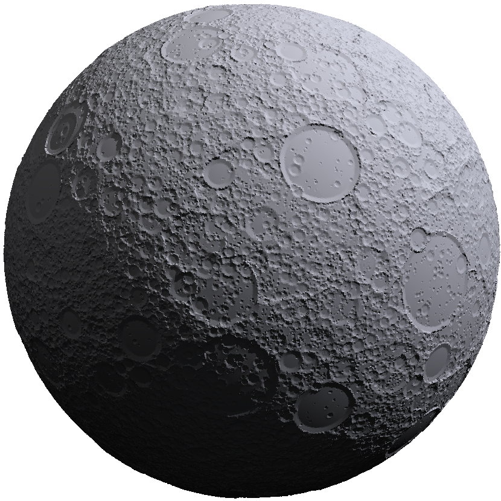

.. currentmodule:: cratermaker

.. _ug-simulation:

Simulation
==========

The :class:`Simulation` class manages the evolution of cratered planetary surfaces. It contains components such as target bodies, impactor distributions, and emplacement to simulate crater formation over time.

A `Simulation` instance can be initiated with keyword arguments specifying the various component models to be used in the simulation. These components include:

- :ref:`Target <ug-target>`
- :ref:`Scaling <ug-scaling>`
- :ref:`Production <ug-production>`
- :ref:`Morphology <ug-morphology>`
- :ref:`Surface <ug-surface>`
- :ref:`Projectile <ug-projectile>`
- :ref:`Counting <ug-counting>`

Any valid arguments for these components can be passed directly to the :class:`Simulation` constructor, otherwise default values will be used (see the guide for :ref:`Default Behavior <ug-defaults>`).

Running a Simulation
--------------------

Once a :class:`Simulation` instance has been created, the simulation can be run using the :meth:`run() <cratermaker.Simulation.run>` method. This method requires an `age` argument specifying the duration of the simulation in million years (My).  

The following example configures a simulation targeting the Moon and runs it for 3 Gy, then we plot the number of true emplaced craters as well as the number of observed craters that the crater counting algorithm has determined are observable. To speed up the example, we have reduced the resolution of the surface grid from the default value of 8 to 6 using the ``gridlevel`` argument, and we suppress any questions about overwriting old files by passing ``ask_overwrite=False``.

.. ipython:: python
    :okwarning:

    from cratermaker import Simulation
    sim = Simulation(target="Moon", gridlevel=6, ask_overwrite=False)
    sim.run(age=3000)
    print(f"Number of true emplaced craters: {len(sim.counting.emplaced)}")
    print(f"Number of observed craters: {len(sim.counting.observed)}")

More detailed component examples are provided in the Gallery section.

.. seealso::

    - :ref:`api-simulation` for the API reference
    - :ref:`gal-simulation` for example simulations, including visualizations
