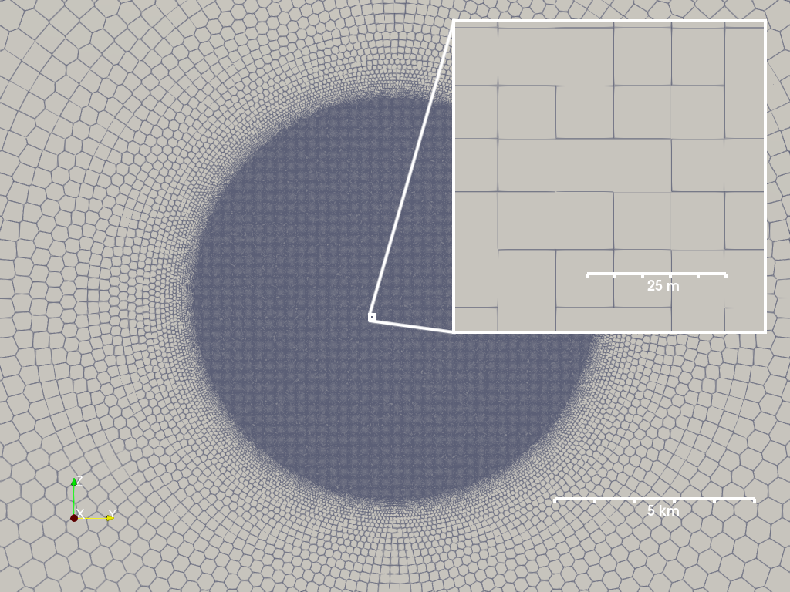

.. currentmodule:: cratermaker

.. _ug-surface:

Surface
=======

Cratermaker's :ref:`Surface <api-surface>` component is used to represent target body's topography and other properties of its surface. Its prupose is to handle surface-related data by providing methods for setting elevation data, and calculating surface-related questions. The Surface class number of attributes and methods that allow the user to perform various operations on the surface. Every Surface object contains the following basic attributes:

- :attr:`target`: The :ref:`Target <ug-target>` that the surface is associated with. The default target is "Moon."
- :attr:`radius`: The radius of the target body in meters. This is a convenience attribute that retrieves the radius from the :ref:`Target <ug-target>` object.
- :attr:`smallest_length`: The smallest length scale that the surface can resolve. This is used for determining minimum elevation changes, such as when ejecta deposits are added to the surface. It is set when the surface is created.
- :attr:`gridtype`: The type of surface grid that is being used. This will be one of "icosphere", "arbitrary_resolution", or "hireslocal", depending on how it was created.
- :attr:`data_dir`: The directory where the surface data files are stored. 
- :attr:`uxds`, :attr:`uxgrid`: The UxArray dataset and grid object used to represent the surface mesh (see the next section for more details).

The UxArray-based surface mesh
------------------------------

The surface of a celestial body in Cratermaker is represented as a sphere that has been discretized as an unstructured polygonal mesh using the `UxArray <https://uxarray.readthedocs.io/en/latest/index.html>`_ package. UxArray provides a rich set of tools for representing unstructured mesh geometry and data associated with the mesh, through their `UxDataset <https://uxarray.readthedocs.io/en/latest/user-guide/data-structures.html#uxdataset>`_ and associated `Grid <https://uxarray.readthedocs.io/en/latest/user-guide/data-structures.html#grid>`_.  The surface mesh is composed of faces, nodes, and edges, where each face is a polygonal shape defined by its nodes. The faces are connected to each other through edges, and the nodes are the points in space that define the corners of the faces. A simple diagram showing the relationship between faces, nodes, and edges is shown below:

.. image:: ../_static/mesh_diagram.svg
    :alt: Surface faces, nodes, and edges
    :align: center
    :width: 300px

In the above image, show a single face with 6 nodes and 6 edges, surrounded by 6 neighboring faces. Each face, node, and edge is identified with an integer index. A Surface object contains a number of attributes that represent the mesh geometry and connectivity, such as:

- :attr:`n_face`: The number of faces in the surface mesh.
- :attr:`n_node`: The number of nodes in the surface mesh.
- :attr:`n_edge`: The number of edges in the surface mesh.
- :attr:`face_area` : An array that contains the area of each face in m\ :sup:`2`
- :attr:`face_size` : The "effective" size of each face, which is defined as the square root of the area of each face in meters.
- :attr:`pix` : The estimated effective size of the faces in meters.  
- :attr:`pix_mean` : The mean effective size of the faces in meters. This is the average of the `face_size` array.
- :attr:`pix_std` : The standard deviation of the effective size of the faces in meters. This is the standard deviation of the `face_size` array.
- :attr:`pix_max` : The maximum effective size of the faces in meters. This is the maximum value of the `face_size` array.
- :attr:`pix_min` : The minimum effective size of the faces in meters. This is the minimum value of the `face_size` array.
- :attr:`face_x`, :attr:`face_y`, :attr:`face_z`: Arrays that contain the x, y, and z coordinates of the center of each face in Cartesian coordinates.
- :attr:`node_x`, :attr:`node_y`, :attr:`node_z`: Arrays that contain the x, y, and z coordinates of each node in Cartesian coordinates.
- :attr:`face_lon`, :attr:`face_lat`: Arrays that contain the longitude and latitude of the center of each face in degrees.
- :attr:`node_lon`, :attr:`node_lat`: Arrays that contain the longitude and latitude of each node in degrees.
- :attr:`face_elevation`: Array that contains the elevation at each face center.
- :attr:`node_elevation`: Array that contains the elevation at each node.

.. note::
    The mesh itself remains static inside Cratermaker, and so the elevations are only applied to the mesh when it is visualized.

Many of the above attributes are based on similar once found in UxArray, though some are modified to be more useful for Cratermaker's purposes. For instance, the `face_area` attribute is computed using the true dimensions of the surface, rather than assuming a unit sphere, which is how UxArray computes it by default. You can access the underlying UxArray structures through the :attr:`uxds` and :attr:`uxgrid` properties.

Mesh connectivity
~~~~~~~~~~~~~~~~~

Many of the functions within Cratermaker require knowledge of the connectivity between faces, nodes, and edges. The Surface object contains several attributes that represent this connectivity:

- :attr:`face_face_connectivity`: An array that contains the faces that surround each face.
- :attr:`face_node_connectivity`: An array that contains the nodes that are associated with each face.  
- :attr:`face_edge_connectivity`: An array that contains the edges that are associated with each face.
- :attr:`node_face_connectivity`: An array that contains the faces that are associated with each node.
- :attr:`edge_node_connectivity`: An array that contains the nodes that are associated with each edge.
- :attr:`edge_length`: An array that contains the length of each edge in meters.
- :attr:`edge_face_distance`: An array that contains the distance between the centers of the two faces that saddle each edge in meters.

As an example of how these are structured, take the diagram shown above of a single face with 6 nodes and 6 edges. The following table shows the connectivity arrays for that face:

.. code-block:: python

    face_face_connectivity[0] = [1, 2, 3, 4, 5, 6]
    face_node_connectivity[0] = [0, 1, 2, 3, 4, 5]
    face_edge_connectivity[0] = [0, 1, 2, 3, 4, 5]
    node_face_connectivity[0:6] = [[1, 0, 2], [0, 3, 2], [0, 4, 3], [5, 4, 0], [6, 5, 0], [6, 0, 1]]
    edge_node_connectivity[0:6] = [[0, 1], [0, 2], [0, 3], [0, 4], [0, 5], [0, 6]]

In the next section we will describe the different types of surfaces that can be created in Cratermaker, and how they are used.

Surface Types
-------------

Like all Cratermaker components, a Surface object is instantiated with a special factory method called :meth:`maker()`, along with arguments that control how the Surface is created. There are currently three different surface types of surface implementations that can be chosen by the user, which are selected by passing the `surface` argument to the :meth:`maker()` method. The available surface types are:

- "icosphere": This is the default surface type, which generates a uniform grid configuration with polygonal faces that will be subdivided by the input value for the `gridlevel` argument. The icosphere surface will have the most uniform face sizes, but is limited to a few resolutions. It is best suited for general use and is the default surface type.
- "arbitrary_resolution": This surface type allows the user to define the approximate size of the faces of the grid using the `pix` argument. It creates a uniform grid configuration but allows for more control over the sizes of the faces. The faces on this surface will be more irregular in shape, making it less ideal for some applications, but it is useful when specific face sizes are needed.
- "hireslocal": This surface type is used for modeling a small local region at high resolution. It requires the `pix`, `local_radius`, `local_location`, and `superdomain_scale_factor` arguments. The local region is the "primary" surface being modeled, and the superdomain is simply a source for distal ejecta from large far away craters. This surface type is useful for applications that require high resolution in a small area, but still allows for global processes to affect the small local area.

The following sections will describe each of these surface types in more detail, including how to create them and their specific attributes and methods.

Icosphere
~~~~~~~~~

The default Surface is "icosphere," which consists of a uniform grid configuration with polygonal faces that are be subdivided by the input value for the `gridlevel` argument. The number of faces and nodes of the icosphere is determined by the formulas :math:`N_{face} = 10\times4^{gridlevel}+2` and :math:`N_{node} = 20\times4^{gridlevel}`. The Surface object contains an attribute called `pix`, which is the value of the "effective pixel size" in meters, where :math:`pix=\sqrt{\left<Area_{face}\right>}`. The following table shows the relationship between the grid level, the number of faces and nodes, and the effective pixel size for a default target of the Moon:
 

.. csv-table::
    :header: "gridlevel", "n_face", "n_node", "pix (for Moon target)"
    :widths: 10, 10, 10, 10

    5, 10242, 20480, 60.8 km ± 2.42 km
    6, 40962, 81920, 30.4 km ± 1.25 km
    7, 163842, 327680, 15.2 km ± 634 m
    8, 655362, 1310720, 7.60 km ± 319 m
    9, 2621442, 5242880, 3.80 km ± 160 m

Though it is limited to a few resolutions, the icosphere surface will have the most uniform face sizes. Lower values of `gridlevel` will result in fewer but larger face sizes, which can be computed quickly but will not resolve detail well. Higher values of `gridlevel` will result in more faces with smaller areas, which will resolve detail better but will take longer to generate and use, and will consume more memory. The default value is 8, and we recommend keeping `gridlevel` to between ~7-9. Also, keep in mind that the value of `pix` in the table above is computed for the Moon, and will vary for other targets. 

.. ipython:: python
    :okwarning:

    from cratermaker import Surface
    surface=Surface.maker()
    print(surface)

This is equivalent to:

.. ipython:: python
    :okwarning:

    surface=Surface.maker(surface='icosphere', gridlevel=8, target='Moon')
    print(surface)

Arbitrary Resolution 
~~~~~~~~~~~~~~~~~~~~

While the `icosphere` surface generates the most regular grids, it is limited to only a few fixed face sizes. If you wish to have more control over the sizes of your faces, you can use the "arbitrary_resolution" surface type instead of "icosphere." The "arbitrary_resolution" surface takes an argument called `pix`, which sets the approximate size of the faces of the grid. The value of `pix` is given in units of meter, and it is defined such that the area of each face will on average be :math:`pix^2`.  For instance, suppose we want to create a surface representation of planet Mercury with a resolution of ~20 km per face (shown in the figure above):

.. ipython:: python
    :okwarning:

    surface=Surface.maker(surface='arbitrary_resolution', target='Mercury', pix=20e3)
    print(surface)

The arbitrary resolution grid is similar to the icosphphere grid in that the surface will be discretized into approximately equal-sized faces. Unlike the icosphere, the faces on the surface will be more irregular in shape, making it less ideal. 

High Resolution Local
~~~~~~~~~~~~~~~~~~~~~

In many application of Cratermaker, it is useful to model a small local region at high resolution. This can be done with the "hireslocal" Surface type. This Surface requires the following 4 arguments:

- `pix`: The pixel size in meters within the high resolution local region.
- `local_radius`: The radius of the local region in meters.
- `local_location`: The center of the local region in degrees, given as a tuple of (longitude, latitude).
- `superdomain_scale_factor`: A scale factor that determines how much larger the faces will be at the antipode of the local region.

.. note::
    When used as part of a :ref:`Simulation <ug-simulation>`, the `superdomain_scale_factor` can be omitted. It is computed using the Simulation's production and morphology models in order to compute the sizes of faces in the superdomain as a function of distance from the local region boundary. 

For instance, suppose we want to generate a high resolution local grid on the Moon with a resolution of ~10 m per pixel, with a high resolution region radius of 5 km, centered at the equator and prime meridian (0° longitude, 0° latitude), and a superdomain scale factor of 10,000:

.. ipython:: python
    :okwarning:

    surface=Surface.maker("hireslocal", pix=10.0, local_radius=5e3, local_location=(0, 0), superdomain_scale_factor=10000)
    print(surface)

The image above shows a rendering of this high resolution local grid, showing a view of the whole local region and an inset showing the high resolution portion inside. The local region will have approximately square and equal-sized faces, but the faces will be more irregular in shape as you move away from the center of the local region. The superdomain will have larger faces that are scaled by the `superdomain_scale_factor`, which allows for distal ejecta to be modeled from large far away craters. The superdomain is not a separate surface, but rather a part of the same surface that is used to model the effects of distant craters on the local region.
The "hireslocal" surface type works somewhat differently than the others. For instance, the diffusive degradation is only applied on the local region. You can think of the local region as the "primary" surface being modeled, and the superdomain as simply a source for distal ejecta fram large far away craters. 

Extracting a local subsection of the surface
--------------------------------------------

.. image:: ../_static/localsurface_diagram.svg
    :alt: LocalSurface region diagram
    :align: center
    :width: 400px

Many of the operations that Cratermaker does on a surface only affect a small portion of the full grid at a time. The Surface class has a tool that is used to efficiently extract a local subsection of a given surface without making a copy in memory. This is done by creating a :class:`LocalSurface` object, which is a view of the original surface that only contains the faces and nodes within a specified radius of a given location. The LocalSurface object can be used to perform operations on this local region rather than on the full set of faces, nodes, and edges. To generate a LocalSurface, you can use the :meth:`extract_region` method of the Surface class. This method takes two arguments: `location`, which is a tuple of (longitude, latitude) in degrees, and `region_radius`, which is the radius of the region in meters.

For instance, suppose we'd like to extract a 16 km radius region at the south pole of the Moon:

.. ipython:: python
    :okwarning:

    surface=Surface.maker()
    print(surface)
    region=surface.extract_region(location=(0,-90),region_radius=16e3)
    print(region)

As we can see, this selects only 33 of the full 655362 faces, which is a significant reduction in the number of faces and nodes that need to be processed. All faces with their centers interior to circle defined by location and region_radius are included, as well as their associated edges and nodes (highlighted in the diagram above). In addition, the region will also contain a "buffer" of all faces that surround the outermost border of the local region, such that any operations that require neighboring faces across included edges or nodes can have access to them. 

.. note::
    The "hireslocal" Surface type contains a built-in attribute called `local`, which represents the high resolution region of the surface. In addition, when `extract_region` is called on a "hireslocal" surface, it will return a special `LocalHiResLocalSurface` object that contains within it an additional object called `local_overlap`. This is a view of only the portion of the extracted region that overlaps the high resolution region (or None if there is no overlap).

Using a Surface object
----------------------
Once you have either a Surface or LocalSurface object, you are now able to perform numerous surface-related computations. 

- :meth:`extract_region`: Extracts a local region of the surface, which is useful for performing operations on a small portion of the surface without affecting the full surface. This returns a `LocalSurface`` object.
- :meth:`add_data`: Adds a new data variable that is associated with either faces (default) or nodes of the surface. 
- :meth:`update_elevation`: Updates the elevation data of the surface using the `new_elevation` argument. The data is added to the existing elevation data by default, unless the user specifies `overwrite=True`.
- :meth:`apply_diffusion`: Applies diffusive degradation to the surface, which is a process that smooths out the surface by averaging the elevations of neighboring faces. This is useful for simulating the effects of erosion over time.
- :meth:`slope_collapse`: Applies diffusion only to surfaces that are steeper than a given threshold  given by the argument `critical_slope_angle`, which is set to 35 degrees by default (a typical value for the angle of repose). 
- :meth:`apply_noise`: Applies tubulence-style simplex noise to the surface. This can be useful for generating realistic surface features, such as hills and valleys. The noise is applied to the elevation data of the surface.
- :meth:`calculate_face_and_node_distances`: Returns one array for distances between a point and all faces, and another array with distances between that point and all nodes.
- :meth:`calculate_face_and_node_bearings`: Returns two arrays: Bearings (direction in degrees) between a point and all faces, Bearing between a point and all nodes.
- :meth:`find_nearest_face`: Returns the index of the face that is closest to a given point. 
- :meth:`find_nearest_node`: Returns the index of the node that is closest to a given point. 
- :meth:`interpolate_node_elevation_from_faces`: Some operations only affect faces, and so this method can be used to interpolate the elevation of nodes from the face elevations.
- :meth:`elevation_to_cartesian`: Convert elevation values to Cartesian coordinates. This is a basic utility function that takes the cartesian positions of the surface of a sphere and elevation values and returns the Cartesian coordinates of the surface with the elevations applied. This is used because the mesh is never altered in Cratermaker, but rather the elevations are applied to the mesh when it is visualized.
- :meth:`get_random_location_on_face`: Given a face index, this method will return a random location on that face. This is used to generate craters on a surface, as some surfaces have highly variable faces and therefore production functions must be evaluated on a face-by-face basis.

.. note::
    The LocalSurface object comes with distances and bearings from the center of the local region pre-computed. See below:

.. ipython:: python
    :okwarning:

    region=surface.extract_region(location=(205,45),region_radius=10e3)
    print(f"Region face distances:\n{region.face_distance}")
    print(f"Region face bearings:\n{region.face_bearing}")

Examples
--------

Extracting a local subset of the grid
~~~~~~~~~~~~~~~~~~~~~~~~~~~~~~~~~~~~~

Suppose wish to extract a 10 km radius local region of the surface of the Moon centered at 45° N latitude, 205° E longitude:

.. ipython:: python
    :okwarning:

    surface=Surface.maker()
    region=surface.extract_region(location=(205,45), region_radius=10e3)
    print(f'Local region: {region}')

The ``region`` object now contains a view of all faces (along with their corresponding nodes and edges) of a local subset of the grid. Because it is a view of the surface not a copy, it allows for fast computation on small portions of the full grid..

Distances and bearings 
~~~~~~~~~~~~~~~~~~~~~~

The :class:`LocalSurface` object has two attributes called `face_distance` and `face_bearing` (and also `node_distance` and `node_bearing`), which are pre-computed distances and bearings from the center of the local region to all faces (nodes). This is useful for quickly accessing these values without having to compute them yourself.

.. ipython:: python
    :okwarning:

    print(f'Face distances from center of local region: {region.face_distance}')
    print(f'Face bearings from center of local region: {region.face_bearing}')

We can see that the local region contains points outside of the 10 km region. We can see that this region contains 20 faces and 25 nodes, but only 7 of the faces actually lie within the 10 km local region, while the other 13 are part of the buffer. From here, we can perform many of the calculations as seen in the list above. 

We can also calculate these for any arbitrary point within the local region (or full surface) using the methods :meth:`calculate_face_and_node_distances` and :meth:`calculate_face_and_node_bearings`. For instance, suppose we want to find the distances and bearings between a point at (205,45) and all faces and nodes in the local region:

.. ipython:: python
    :okwarning:

    face_distance, node_distance=region.calculate_face_and_node_distances(location=(205,45))
    print(f'Distances betwen location (205,45) and faces :{face_distance}')
    print(f'Distances betwen location (205,45) and nodes :{node_distance}')

With this method, two arrays are returned where the first array gives us an array of distances between the input location and the all faces, and the second array returns the distances from the input locaion and all of the nodes. It is best to use this method on smaller regions due to the size of the arrays if used on entire surface. We can do a similar calculation, but rather finding the distances between a location and the faces and nodes, we find the bearings: 

.. ipython:: python
    :okwarning:
    
    face_bearing, node_bearing =region.calculate_face_and_node_bearings(location=(205,45))
    print(f'Bearings betwen location (205,45) and faces :{face_bearing}')
    print(f'Bearings betwen location (205,45) and nodes :{node_bearing}')

As you can see from above, we recieve two arrays, which are the same sizes as the previous examples. However, they now tell us the "initial bearing" (the direction relative to due North) between a point and all faces and all nodes. 

Finding a face index
~~~~~~~~~~~~~~~~~~~~

Suppose we would like to find a face correspnding to a particulal location. We can do the following:

.. ipython:: python
    :okwarning:

    face_index=surface.find_nearest_face(location=(205,45))
    print(f'Nearest face to (205,40): {face_index}')

As seen above, we recieve an integer that gives us the index to the nearest face. One caveat is that this method will return the index of the face in which its center is the closest to the input location. Due to the shapes of the faces, this may or may not correspond to the face that contains the input location. However, it should correspond to at least one of the faces that borders the one containing the input location. You can view which faces these are using one of the built-in connectivity arrays. In this case, :attr:`face_face_connectivity`` contains the array of faces that are connected to a particular face:

.. ipython:: python
    :okwarning:

    print(f'Neighboring faces of {face_index} include: {surface.face_face_connectivity[face_index]}')

There are corresponding methods for finding the nearest node, as well as connectivity arrays for nodes, such as :attr:`node_face_connectivity` (faces associated with each node) and :attr:`face_node_connectivity` (nodes associated with each face).

.. note::
    Due to the variable number of nodes and edges associated with each face, there will sometimes be unused elements of the connectivity arrays. These are set to a large negative number, and so filtering out only indices greater than or equal to 0 will give you the valid indices. 

Converting elevation to Cartesian coordinates
~~~~~~~~~~~~~~~~~~~~~~~~~~~~~~~~~~~~~~~~~~~~~

Cratermaker saves the face and node elevations independently of the mesh geometry. Suppose you want to visualize the surface with the elevations applied. You can use the :meth:`elevation_to_cartesian` method to convert the elevations to Cartesian coordinates. This method takes one argument, `element`, which can either be "face" or "node". The method will return an (n, 3) array of Cartesian coordinates, where n is the number of faces or nodes, depending on the value of `element`.

.. ipython:: python
    :okwarning:
    
    region = surface.extract_region(location=(0,0), region_radius=10e3)
    cartesian = region.elevation_to_cartesian(element='face') 
    print(cartesian)

This could be used to visualize the surface using a 3D plotting library, such as Matplotlib or Plotly. The Cartesian coordinates will have the elevations applied, so you can see the topography of the surface.

More Surface examples
---------------------

See more examples at  :ref:`gal-surface`

