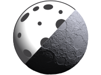
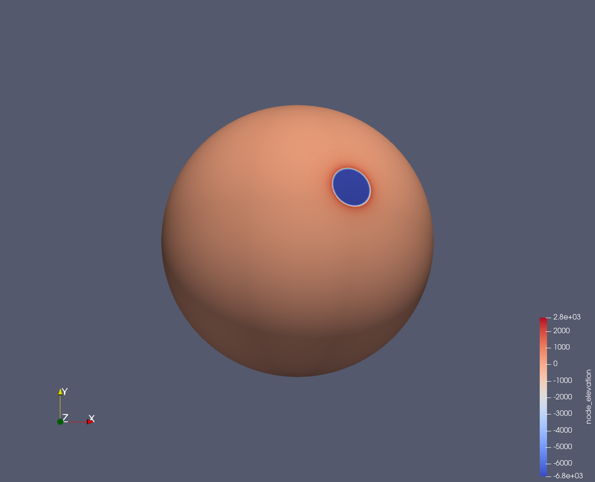

.. currentmodule:: cratermaker

.. _ug-visualizing:

Visualizing the surface 
=======================

Cratermaker can export the surface mesh to a VTK file, which can be visualized with tools like `PyVista <https://docs.pyvista.org/>`__  and `ParaView <https://www.paraview.org/>`__. In this example, we will emplace a 500 km crater on the Moon at a location of 60° N, 45°E, and then visualize the surface mesh using Pyvista.

The simulation will generate several files in a folder called ``surface``, including ``grid.nc`` and ``surf000000.nc``. When exported to vtk format, a file called ``surf000000.vtp`` will also be placed in the ``export`` folder. In this example, the simulation only contains one interval, so only one file is created (see :ref:`ug-Simulation` for how to run multi-interval simulations). 

We can then open up the mesh in PyVista for visualization

.. ipython:: python
    :okwarning:
    :suppress:

    # Remove any existing output for a clean environment so we don't get prompted about overwriting files
    from cratermaker import cleanup
    cleanup()

.. pyvista-plot::
   :caption: Using show3d to visualize the surface mesh.
   :include-source: true

    >>> import cratermaker as cm
    >>> sim = cm.Simulation(gridlevel=6)
    >>> sim.emplace(diameter=500e3, location=(45,60))
    >>> sim.show3d()

.. pyvista-plot::
   :caption: Using show3d to visualize the surface mesh.
   :include-source: False 

    >>> # The pyvista-plot tool apparently doesn't recognize the show3d method, so we will just show how to do this manually with pyvista.
    >>> import pyvista as pv
    >>> import cratermaker as cm
    >>> sim = cm.Simulation(reset=False)
    >>> sim.export(driver="vtk", ask_overwrite=False)
    >>> mesh = pv.read(sim.export_dir / "surface000000.vtp")
    >>> mesh.plot(cmap="cividis")
        

We can also export the surface mesh to a VTK file that can be opened up with other visualization tools, like `ParaView <https://www.paraview.org/>`__.

.. code-block:: python

    sim.export(driver="VTK")

ParaView can be used to visualize the surface mesh, and also to create animations of the surface evolution. For more information on how to use ParaView, see the `ParaView documentation <https://www.paraview.org/documentation/>`__.

.. ipython:: python
    :okwarning:
    :suppress:

    cleanup()